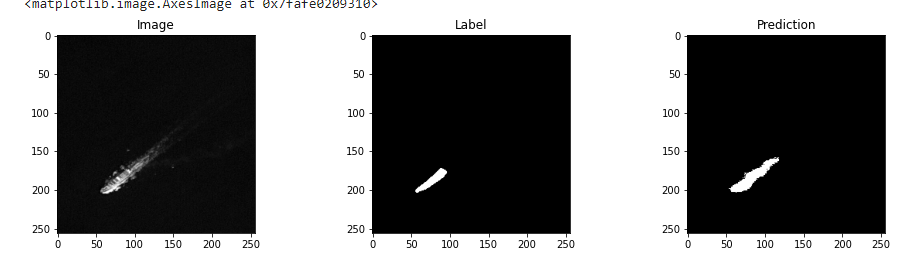

##**Brief Introduction**
This test project is about about simple semantic segmentation with one class, using U-Net model.

The whole project written on python, in jupyter notebook, so it can be easily computed on services such as Kernels or Google Colab. 

The results of the program are also displayed in the notebook.

##Data storage
For data storage I used Google drive because Google Colab allows you easily exract data right into the notebook. You can also use either your own cloud/non-cloud data storage. I also attached 3 folders of images ``image_train_dataset`` ``image_masks_dataset`` ``image_validation_dataset`` you can use directly from your computer using jupyter lab

##Binary masks for images
To prepare model training we need some samples of images where required objects/classes are already segmented. 
I used [apeer.com/annotate](https://www.apeer.com/annotate) to label 54 images for mask dataset. As a result you get all labeled __*.tiff__ grayscale images and for each class you get a specific level (in my case 0 stands for background and 1 stands for ship objects). 

##Extracting images
I extracted images using function ``glob()`` from module ``glob`` and then read it using ``cv2.imread()``
Then I resized all images to 256x256 to reduce resource usage. 
Eventually I made numpy array from all the images and expanded the dimensions of array to get required shape of image array 
``(Number_of_images , Height , Width, Channels)``
The same operations I commited to mask dataset

##Preparation to training
First of all you need to split your training data using ``sklearn.model_selection.train_test_split(img_dataset, mask_dataset, test_size, random_state)``
Don`t forget to perform "Sanity checks" to see if your image and masks data matches and troubleshoot before actual model training

##U-Net 

For building model I used U-net, and made few functions to reshape dataset images into segmentation maps for training

##Compiling model
To compile a model you need to know what attributes you going to use. 
As for optimizer I used ``Adam`` with really low learning rate because of huge class imbalance on the images, so model won`t ignore some small ships in relatively big image.
As for loss I used ``"binary-crossentropy"`` as I'm working only with two classes( background and ship ). If you want to use this program for multiclass segmentation you ought to use ``"categorical-crossentropy"``.
In ``metrics`` attribute you able to use variety of availiable metrics such as 'accuracy', 'IoU' or pre-coded dice coefficient function.

##Training model
To train the model you are able to use ``model.fit()`` function and input training data splitted before. To improve a prediction outcome I trained it for 500 epochs. 

##Results
Even though I used small dataset with low variety of images network given me pretty decent results. You can improve this network`s efficiency by expanding image datasets or training it for more epochs

